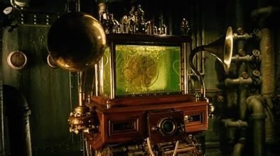

# Open Mind Fun

>We philosophers are better at questions than answers.
>Finding better questions to ask, and breaking old habits and traditions of asking.     KINDS OF MIND, Daniel Dennett

In the Jean-Pierre Jeunet's film [La Cité des Enfants Perdus](http://www.imdb.com/title/tt0112682/?ref_=nv_sr_1), there was this character Irvin, a brain floating in an aquarium, reminding me of the example of a brain set up in a life-support system in a vat as Daniel Dennett described in his Consciousness Explained. In order to simulate the reality, a combinatorial explosion of questions are raised.
Two issues could be further studied here:
* 
What is brain? What is the relationship between a brain and a man?
* 
What is the function of combinatorial explosion and the application of it?